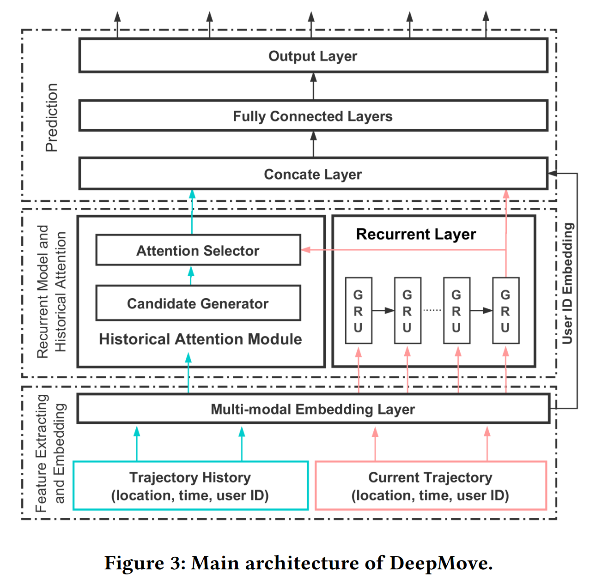

## Next-Location Prediction

*@Date: 2022-9-18*

*@Author: xuexun01*
- [Next-Location Prediction](#next-location-prediction)
  - [1. Introduction](#1-introduction)
  - [2. Problem definition](#2-problem-definition)
  - [3. Metrics](#3-metrics)
  - [4. Related papers](#4-related-papers)
    - [4.1 DeepMove: Predicting Human Mobility with Attentional Recurrent Networks](#41-deepmove-predicting-human-mobility-with-attentional-recurrent-networks)

### 1. Introduction

&emsp;&emsp;Next-location prediction is about forecasting which location an individual will visit given historical data about their mobility. It may help policymakers organize the public transportation network, urban planners decide a city's future developments, and transportation companies provide citizens with a better service in terms of traffic reduction and ease of mobility.

&emsp;&emsp;**What info should next-location prediction capture?**

* spatial, temporal and social-geographic dimensions of human mobility

    individual spatial patterns & individual temporal patterns

* extenral factors

    e.g. weather conditions

* user preferences

    e.g. POIs, friendships

### 2. Problem definition

&emsp;&emsp;Next-location prediction consists of forecasting the next location an individual will visit in the future, given their historical mobility data.

&emsp;&emsp;Formally, let $u$ be a user, $T_u$ their trajectory, and $p_t \in T_u, u$'s current location, next-location prediction aims at predicting $u$'s next destination $p_{t+1}$. This problem is treated in two ways:

* as a multi-classification task

    we have as many classes as locations and we aim at predicting the next visited location: $p_{t+1}$

* as a regression task

    predicting $p_{t+1} = (x_{t+1}, y_{t+1})$, where $x_{t+1}$ and $y_{t+1}$ are the next location's geographic coordinates.

&emsp;&emsp;A variant of next-location prediction aims at forecasting the next Point Of Interest(POI) $p_{t+1}$ an individual $u$ will visit. given their trajectory $T_u$.

&emsp;&emsp;Regardless of the specific definition, next-location predictors output a ranking of the probability of each location to be $u$'s next destination.

### 3. Metrics

&emsp;&emsp;Next-location prediction can be intended as a regression task or a multi-class classification task. Both have their own metric. Regardless of metrics, next-location preditors output a ranking of the probability of each location to be an individual's next destination. 

* regression task

    Haversine distance, equirectangular distance

* multi-class classification task

    accuracy, recall, F1-score, Mean Average Percentage Error, Area Under the Curve

### 4. Related papers

#### 4.1 [DeepMove: Predicting Human Mobility with Attentional Recurrent Networks](./DeepMove%3A%20Predicting%20Human%20Mobility%20with%20Attentional%20Recurrent%20Networks.pdf)

Contribution:

* propose an attentional recurrent model, DeepMove to predict human mobility from long-range and sparse trajectories.

* design two attention mechanisms: embedding encode module and sequential encode module

Model Architecture:

